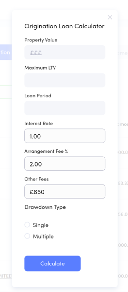
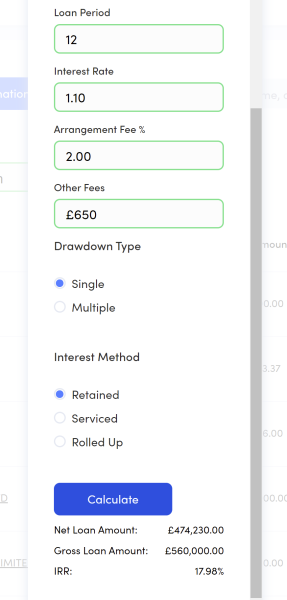
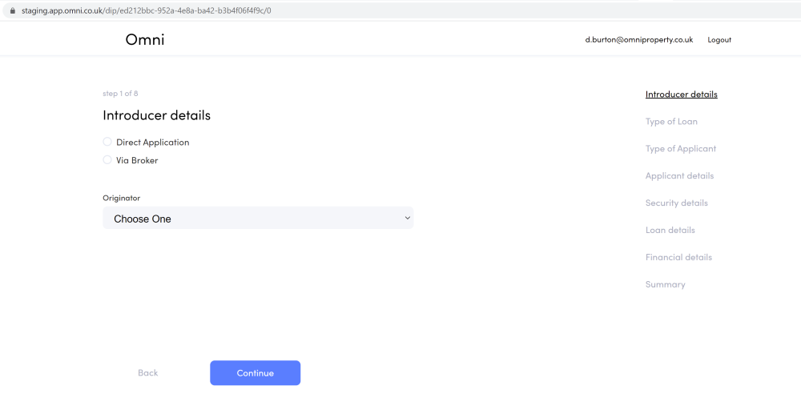
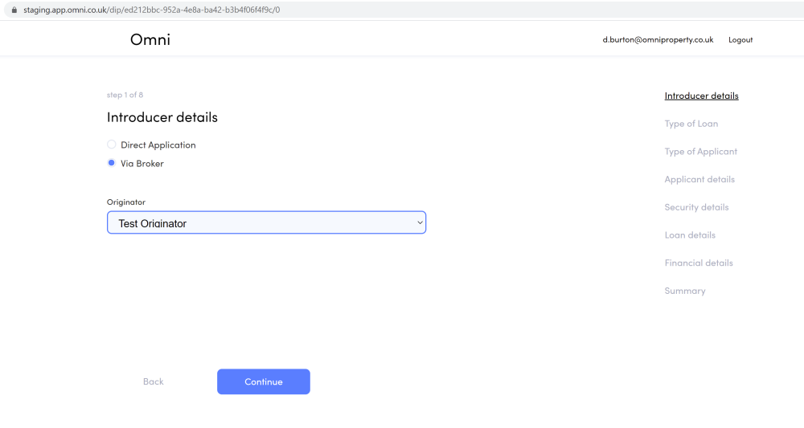

# Pre-Application

- Enquiries
- Pop-up calculator
- DIP

---

# Enquiries

- Minimal inputs required
- Estimated values added to pipeline
- Calculations currently manual using the pop-up calculator

---

# Pop-up calculator

- Support single or multiple advances
- Core interest and fees can be set
- Option for more advance calculations to come later
- For now if a more detailed figure is needed create a DIP

---

### Pop-up calculator - starting form

---

### Pop-up calculator - results

---

# DIP

- Most fields required
- Wizard process
- Summary of calculations shown at the end
- Results in a DIP document (in PDF format)
- Can convert an Equiry or create from scratch

---

### DIP - Introducer Details

---

### DIP - Introducer Details

