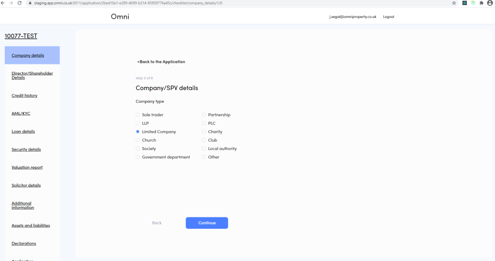

# Application

- Always started from an Issued DIP
- All details from the Application form are available
- Wizard flows for entering data
- Read-only summary view to show all data in compact form
- Facility Letter can be generated 

---

### Application - Convert from DIP to Application

---

### Application - Initial Application Summary

---

### Application - Company Details - Step 1

---

### Application - Company Details - Step 2

---

### Application - Company Details - Step 3

---

### Application - Company Details - Step 4

---

### Application - Company Details - Step 5 

---

### Application - Company Details - Step 6

---

### Application - Company Details - Completed

---

### Application - Application Summary - Updated Company Details

